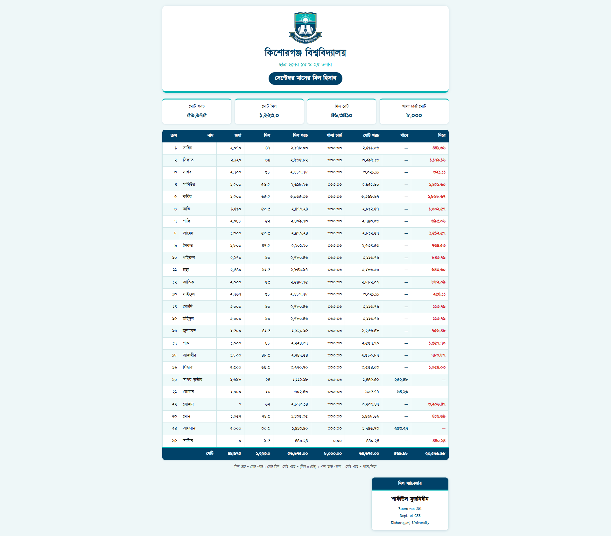

# Meal Hisab

Student Hall Meal Account System of **Male Hall** (1st & 2nd Floor)
# Kishoreganj University

# [Live Website](https://sumujnibeen.github.io/mill_hisab/)

## About

**Meal Hisab** is a simple web-based monthly meal account system created for the residents of the 1st and 2nd floors of the Student Hall at Kishoreganj University. It keeps the monthly meal records organized and makes it easy for everyone to check their own account without having to go through the entire calculation manually.

The system keeps track of:

* Total amount deposited
* Number of meals taken
* Total meal cost
* Remaining balance
* Amount owed or receivable

The main goal is to keep the monthly account **simple, transparent, and easy to access**.

## Why Meal Hisab?

Managing a shared mess can get complicated pretty quickly.

There are deposits, meal counts, meal rates, balances, and eventually that one question everyone asks at the end of the month:

**"So, how much do I actually owe?"**

Meal Hisab puts all of that information in one place.

Instead of keeping the records only in notebooks, spreadsheets, or someone's phone, the monthly account can be accessed directly from the website by anyone who needs to check it.

It also helps preserve the early meal records of the newly established hall, turning a simple monthly calculation into a small digital record of hall life.

## Purpose

Meal Hisab was created to make a small but important part of shared hall life easier.

The goal is not to build a complicated accounting system. It is simply to make the monthly meal account **clear, accessible, and easy for everyone to verify**.

A little organization can save a lot of questions at the end of the month.

## Preview

 

The monthly meal records are managed and maintained by:

**Shafiul Mujnibin**
Room No. 201
Department of Computer Science and Engineering
Kishoreganj University

The responsibility includes maintaining the monthly records, organizing meal and deposit information, and preparing the final account for the residents.

